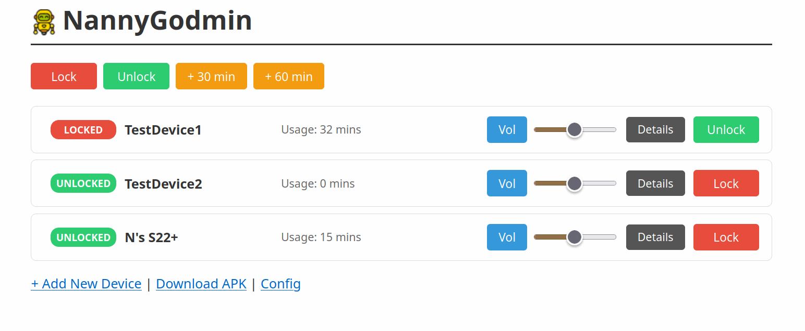
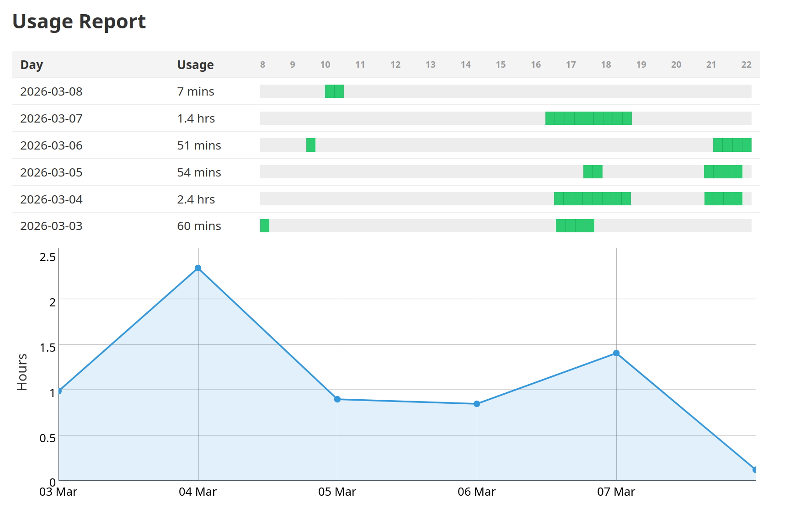

# NannyGodmin

NannyGodmin is a parental control/remote management and monitoring Android service. It is designed to run as a persistent foreground service, track user activity, capture screenshots remotely, and allow a remote server to "lock" the device or adjust system settings. It's not meant to be used as an MDM (for starters, there is no attestation), it's meant to be used as a remote control for devices in a known safe security domain (ie only use it in your LAN), with non adversarial users.

## Features

* Lock/unlock all devices, manually, or automatically based on usage thresholds or on a timer
* Remotely set devices' volume
* Request devices' screenshots
* Get a usage report to monitor when the device was active each day, and how long it was used for
* Get a list of used apps, and for how long they were active

## Installing (as a non owner app)

Install the server environment with `make rebuild_deps` then `make run` to start the service. You may want to set it up as a systemd unit, too.

With the server running, build the apk and install as normal `adb install ./app-debug.apk`. Alternatively, you may place the apk as godmin.apk in the server root, and then download the apk from the server and install manually. No prebuilt apks are provided: Godmin is a "prototype" and requires quite a bit of setup, if building an apk is a challenge then the rest of the setup is going to be impossible.

Once the app is installed to a client, it should open the config view, where you can grant the necessary permissions to the app, and follow the provisioning steps. To provision, enter your server's URL or scan the server's QR with your device.

## Installing (in owner mode)

Normal installation will let you use basic features such as locking and app monitoring, but it has drawbacks: screenshots and deep app monitoring won't work, and users may uninstall the app at any time. This is a limitation of running as a normal user app (and a good one: you wouldn't want a normal Android app to be able to spy on you like this app does). This may be good enough for the use case this product was created for, at least until the target users discover they can uninstall the app. For deeper control of the device, you will need to install it in owner mode.

TODO: Build owner mode installation

## Installing in an Amazon Fire tablet

Amazon tables are slightly special, with different policies than most normal Androids. You also probably want to enable the service for a user account, not for the main account. To install Godmin in one:

1. `adb shell pm list users` to find the user id you need
2. `adb install -t --user 11 ./app-debug.apk` (replace the user id; -t is only needed if installing the debug apk)
3. `adb shell pm enable --user 11 com.nicobrailo.nannygodmin`
4. `adb shell am start --user 11 -n com.nicobrailo.nannygodmin/.ConfigActivity`

The app won't appear in the dashboard, but the last command should start it and let you provision it. Some features won't be available, but usage monitoring and locking seems to work.

